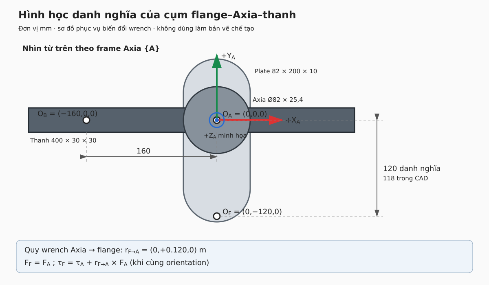

# Hình học cụm flange–Axia–thanh

Sơ đồ trên được dựng từ assembly STEP trong `Downloads/Person_1`, đối chiếu
chi tiết vỏ Axia trong `Downloads/Person2`, và các khoảng cách người vận hành
cung cấp. Đây là sơ đồ biến đổi wrench, không phải bản vẽ chế tạo.

Ảnh đo thực tế [Screenshot from 2026-09-18 12-10-21.png](<../../Pictures/Screenshots/Screenshot from 2026-09-18 12-10-21.png>)
xác nhận khoảng cách tâm Axia–tâm flange là 120 mm. Tâm Axia được lấy tại
tâm vòng tròn sáu lỗ; tâm flange tại tâm vòng tròn bốn lỗ. Ký hiệu Y+ trên
ảnh là Y+ của Axia. Ảnh [assembly_iso_rear.png](<../../Downloads/Person2/assembly_iso_rear.png>)
phù hợp với thứ tự lắp plate → Axia → spacer → thanh và vị trí connector.

## Các điểm và vector đang dùng

Tạm biểu diễn mọi vector trong hệ trục Axia \(\{A\}\):

- \(O_A=(0,0,0)\): tâm/gốc tham chiếu Axia.
- \(O_F=(0,-0.120,0)\ \mathrm{m}\): tâm flange theo số đo danh nghĩa.
- CAD đặt tâm pattern flange tại \((0,-0.118,0)\ \mathrm{m}\); phép đo thực tế
  ưu tiên giá trị \(0.120\ \mathrm{m}\) cho mặt phẳng XY. Sai khác 2 mm vẫn
  được đưa vào kiểm tra độ nhạy để phát hiện sai lệch giữa CAD và gá thật.
- \(O_B=(-0.160,0,0)\ \mathrm{m}\): tâm thanh sắt.
- Stack theo CAD từ mặt dưới plate: Axia 25,4 mm, spacer 7 mm và thanh dày
  30 mm. Hướng Z của mô hình CAD chưa tự chứng minh là chiều Z của frame đo.

Nếu wrench Axia \(W_A=[F_A;\tau_A]\) cần quy về tâm flange, vẫn biểu diễn
trong cùng orientation:

\[
r_{F\rightarrow A}=O_A-O_F=(0,+0.120,0)\ \mathrm{m}
\]

\[
F_F=F_A,\qquad
\tau_F=\tau_A+r_{F\rightarrow A}\times F_A
\]

Nếu một lực tại tâm thanh truyền về Axia:

\[
\tau_A=r_{A\rightarrow B}\times F_B,
\qquad r_{A\rightarrow B}=(-0.160,0,0)\ \mathrm{m}
\]

Các công thức trên chỉ dịch điểm đặt wrench. Nếu frame Axia và tool0 có
rotation \(R\), phải xoay cả lực và moment bằng cùng \(R\) trước hoặc sau
phép dịch theo đúng adjoint; không thể suy \(R\) chỉ từ hai khoảng cách.

## Phần đã xác nhận và phần còn phải đo

Assembly STEP có bốn solid kín, không giao thoa và kích thước bao
401 × 200 × 72,4 mm. Mô hình Person_1 thể hiện cả lỗ nối spacer/thanh;
Person2 thể hiện đầu nối và chi tiết Axia tốt hơn.

Mục 1 và 2 của checklist đã được xác nhận ở mức hình học lắp ráp bằng ảnh đo:
chiều Y+ của Axia và định nghĩa hai tâm đã rõ. Trước khi dùng hình học để
kết luận calibration, còn phải xác nhận trực tiếp:

1. chiều +X/+Z còn lại và dấu moment trên nhãn/bản vẽ Axia;
2. transform rotation từ Axia sang tool0/base_link trong TF runtime;
3. gốc đo wrench có trùng tâm vòng sáu lỗ/hình học được dùng trong CAD hay không;
4. 120 mm đang là khoảng tâm trên mặt plate; cần xác định thêm thành phần Z
   tới gốc đo wrench, bao gồm đúng plate/tấm đệm nào;
5. khối lượng, CoG và inertia của đúng phần tải mà từng nguồn ước lượng lực
   đang bù.

Trong phân tích pilot, chạy ít nhất hai giả thuyết 118 mm và 120 mm để báo
độ nhạy của moment/force khôi phục đối với sai số hình học 2 mm.
